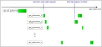

# Async Python

## Parallelism in Python

There exists 3 distinct ways to parallelize code in Python, namely **threading, multiprocessing, and async**. Let us quickly discuss the key differences. For this, we try to parallelize the following 2 code examples:

```python title="sleep.py"
import time
import datetime


def do_work(number: int):
    print(f"{datetime.datetime.now() - start_time}: Start work for {number=}")
    time.sleep(2)
    print(f"{datetime.datetime.now() - start_time}: Finished work for {number=}")


start_time = datetime.datetime.now()
for i in range(5):
    do_work(i)
print(f"Finished program after {datetime.datetime.now() - start_time}")
```


```python title="hard_work.py"
import datetime


def do_real_work(number: int):
    print(f"{datetime.datetime.now()-start_time}: Start work for {number=}")
    output = 0
    for i in range(100_000_000):
        output += 1
    print(f"{datetime.datetime.now()-start_time}: Finished work for {number=}")

start_time = datetime.datetime.now()
for i in range(5):
    do_real_work(i)
print(f"Finished program after {datetime.datetime.now() - start_time}")
```

### Synchronous execution
When we execute the 2 scripts above, we get the following output
```
>>> python3 sleep.py

0:00:00.000010: Start work for number=0
0:00:02.005169: Finished work for number=0
0:00:02.005421: Start work for number=1
0:00:04.008039: Finished work for number=1
0:00:04.008167: Start work for number=2
0:00:06.010063: Finished work for number=2
0:00:06.010195: Start work for number=3
0:00:08.011329: Finished work for number=3
0:00:08.011481: Start work for number=4
0:00:10.016531: Finished work for number=4
Finished program after 0:00:10.016634
```

and:
```
>>> python3 hard_work.py

0:00:00.000005: Start work for number=0
0:00:02.352451: Finished work for number=0
0:00:02.352548: Start work for number=1
0:00:04.687044: Finished work for number=1
0:00:04.687078: Start work for number=2
0:00:07.084300: Finished work for number=2
0:00:07.084339: Start work for number=3
0:00:09.425129: Finished work for number=3
0:00:09.425161: Start work for number=4
0:00:11.770652: Finished work for number=4
Finished program after 0:00:11.770680
```

Thus we can see the following execution times[^1]:

|                	| **Synchronous Execution** 	 |
|:--------------:	|:---------------------------:|
|  **sleep.py**  	|        10          	        |
| **do_work.py** 	|         11.8      	         |

### Threading

Using the `threading` module in Python, one cas easily execute parallel tasks. We then get for the first example:

=== "Code"

    ```python title="sleep.py"
    import time
    import datetime
    from threading import Thread
    
    
    def do_work(number: int):
        print(f"{datetime.datetime.now() - start_time}: Start work for {number=}")
        time.sleep(2)
        print(f"{datetime.datetime.now() - start_time}: Finished work for {number=}")
    
    
    start_time = datetime.datetime.now()
    
    tasks = [Thread(target=do_work, args=(i,)) for i in range(5)]
    for task in tasks:
        task.start()
    for task in tasks:
        task.join()
    
    print(f"Finished program after {datetime.datetime.now() - start_time}")
    ```

=== "Output"

    ``` 
    >>> python3 sleep.py
    
    0:00:00.000071: Start work for number=0
    0:00:00.000126: Start work for number=1
    0:00:00.000168: Start work for number=2
    0:00:00.000205: Start work for number=3
    0:00:00.000246: Start work for number=4
    0:00:02.005241: Finished work for number=0
    0:00:02.005388: Finished work for number=4
    0:00:02.005453: Finished work for number=1
    0:00:02.005475: Finished work for number=2
    0:00:02.005430: Finished work for number=3
    Finished program after 0:00:02.006002
    ```

As can be seen, the program has finished in only 2 seconds instead of 10 seconds, because alls tasks have been processed in parallel and have a runtime of 2 seconds.

However, when we do the same for the other example:

=== "Code"

    ```python title="hard_work.py"
    import datetime
    from threading import Thread
    
    def do_real_work(number: int):
        print(f"{datetime.datetime.now()-start_time}: Start work for {number=}")
        output = 0
        for i in range(100_000_000):
            output += 1
        print(f"{datetime.datetime.now()-start_time}: Finished work for {number=}")
    
    start_time = datetime.datetime.now()
    
    tasks = [Thread(target=do_real_work, args=(i,)) for i in range(5)]
    for task in tasks:
        task.start()
    for task in tasks:
        task.join()

    print(f"Finished program after {datetime.datetime.now() - start_time}")
    ```

=== "Output"

    ``` 
    >>> python3 hard_work.py
    
    0:00:00.000125: Start work for number=0
    0:00:00.000200: Start work for number=1
    0:00:00.019017: Start work for number=2
    0:00:00.049231: Start work for number=3
    0:00:00.080564: Start work for number=4
    0:00:10.813826: Finished work for number=2
    0:00:10.885100: Finished work for number=3
    0:00:10.988489: Finished work for number=0
    0:00:11.014248: Finished work for number=1
    0:00:11.020219: Finished work for number=4
    Finished program after 0:00:11.020369
    ```

we still need 11 seconds like in the synchronous execution. The reason for this lies in the way **threading** is handled by the CPython interpreter. Due to the **Global Interpreter Lock** (GIL), Python ensures that at each moment only one thread can be actively executing the code. Therefore, we are executing multiple functions in parallel, but we are effectively still using only 1 core at a time. This can be seen in the image below.

<figure markdown>
  { width="1000" }
  <figcaption>Work of a Python code with threads (GIL blocking of true parallelism)</figcaption>
</figure>


In the sleep example above, the function was basically doing nothing except waiting (mimicking for example a wait time due to a database or HTTP request). Therefore, the parallel execution works fine, because there is no **real work** to be done.

For the `hard_work.py` code snippet, the execution time is really spent doing actual Python code execution. As can be seen in the output, all 5 tasks will start nearly the same time, but since it will only get 1/5 of the CPU, each task will need about 5 times as much time. As a result, there is no speed improvement when using `threading in Python` for computiationally expensive applications.

The observed execution times so far:

|                	| **Synchronous Execution** 	 | **Threading** 	|
|:--------------:	|:---------------------------:|---------------	|
|  **sleep.py**  	|       10            	       | 2             	|
| **do_work.py** 	|      11.8            	      | 11            	|


### Multiprocessing

Real `multiprocessing` can be used in Python very similar to Threads. Note that in this case, the processed are encapulated in seperate child processed and cannot (easily) access the data from other processes. Let us again modify our two code examples:

=== "Code"

    ```python title="sleep.py"
    import time
    import datetime
    from multiprocessing import Process
    
    
    def do_work(number: int):
        print(f"{datetime.datetime.now() - start_time}: Start work for {number=}")
        time.sleep(2)
        print(f"{datetime.datetime.now() - start_time}: Finished work for {number=}")
    
    
    start_time = datetime.datetime.now()
    
    tasks = [Process(target=do_work, args=(i,)) for i in range(5)]
    for task in tasks:
        task.start()
    for task in tasks:
        task.join()
    
    print(f"Finished program after {datetime.datetime.now() - start_time}")
    ```

=== "Output"

    ``` 
    >>> python3 sleep.py
    
    0:00:00.006796: Start work for number=0
    0:00:00.007449: Start work for number=1
    0:00:00.008078: Start work for number=2
    0:00:00.008823: Start work for number=3
    0:00:00.009255: Start work for number=4
    0:00:02.008293: Finished work for number=0
    0:00:02.008291: Finished work for number=1
    0:00:02.009784: Finished work for number=3
    0:00:02.009597: Finished work for number=2
    0:00:02.010936: Finished work for number=4
    Finished program after 0:00:02.013174
    ```

---

=== "Code"

    ```python title="hard_work.py"
    import datetime
    from multiprocessing import Process
    
    def do_real_work(number: int):
        print(f"{datetime.datetime.now()-start_time}: Start work for {number=}")
        output = 0
        for i in range(100_000_000):
            output += 1
        print(f"{datetime.datetime.now()-start_time}: Finished work for {number=}")
    
    start_time = datetime.datetime.now()
    
    tasks = [Process(target=do_real_work, args=(i,)) for i in range(5)]
    for task in tasks:
        task.start()
    for task in tasks:
        task.join()

    print(f"Finished program after {datetime.datetime.now() - start_time}")
    ```


=== "Output"

    ``` 
    >>> python3 hard_work.py
    
    0:00:00.007729: Start work for number=0
    0:00:00.008396: Start work for number=1
    0:00:00.008928: Start work for number=2
    0:00:00.011777: Start work for number=3
    0:00:00.012632: Start work for number=4
    0:00:02.649805: Finished work for number=2
    0:00:02.655102: Finished work for number=1
    0:00:02.688040: Finished work for number=3
    0:00:02.738391: Finished work for number=4
    0:00:02.888424: Finished work for number=0
    Finished program after 0:00:02.889433
    ```

Now, we finally see real Python use several cores of our CPU to execute the tasks in parallel. This leads us to the following execution times:

|                	| **Synchronous Execution** 	| **Threading** 	| **Multiprocessing** 	|
|:--------------:	|:-------------------------:	|------------	|---------------------	|
|  **sleep.py**  	|             10            	| 2             	| 2                   	|
| **do_work.py** 	|            11.8           	| 11         	| 2.8                 	|


### Asynchronous Python

The last paradigm to execute Python code in parallel is the use of `async/await`. This method kind of resembles the `threading` idea. However, in this case it is not the OS Scheduler that is assigning resources to the tasks/threads, but the async event loop scheduler of Python[^2]. There are several key advantages in comparison to regular threading:

1. Reduces overhead since no additional threads have to be scheduled by the OS
2. More parallel tasks can be scheduled in parallel
3. `async/await` allows for control, where tasks can be paused and resumed

---

Let us now have a look at the `sleep` example:

=== "Code" 

    ```python title="sleep.py" hl_lines="7 14" linenums="1"
    import datetime
    import asyncio
    
    
    async def do_work(number: int):
        print(f"{datetime.datetime.now() - start_time}: Start work for {number=}")
        await asyncio.sleep(2)
        print(f"{datetime.datetime.now() - start_time}: Finished work for {number=}")
    
    
    async def main():
        tasks = [asyncio.create_task(do_work(i)) for i in range(5)]
        for task in tasks:
            await task

    
    if __name__ == "__main__":
        start_time = datetime.datetime.now()
        asyncio.run(main())
        print(f"Finished program after {datetime.datetime.now() - start_time}")
    ```

=== "Output"

    ``` 
    >>> python3 sleep.py
    
    0:00:00.000177: Start work for number=0
    0:00:00.000206: Start work for number=1
    0:00:00.000214: Start work for number=2
    0:00:00.000219: Start work for number=3
    0:00:00.000224: Start work for number=4
    0:00:02.001531: Finished work for number=0
    0:00:02.001620: Finished work for number=1
    0:00:02.001637: Finished work for number=2
    0:00:02.001648: Finished work for number=3
    0:00:02.001660: Finished work for number=4
    Finished program after 0:00:02.002334
    ```

Similar to the `threading` and `multiprocessing` case, we could speed up the program by about a factor 5 here. The key differences here is the way we layout our program:

1. Using the **await** keyword, we can tell the *event loop* to pause the execution of the function and work on another task. The event loop will then execute another task, until another **await** will be called, where the scheduler will give the control to yet another task. In the code above, each part where we tell the event loop that it can temporarily suspend the active task is highlighted. In the real world, these awaited calls often go to systems where we have to wait for a response like *Databases, IO or HTTP Calls*.
2. In line 19, we define the **async event loop**, that will be responsible for scheduling the resources between the tasks, and tell him to execute our **async** `main function.
3. Tasks can be scheduled using `asyncio.create_task`, which will then be executed in parallel. Calling **await** on the tasks will wait for the task to be executed (similar to `Thread.join`). If the async function has a return value, it can just be assigned via `value = await task`. 
4. Only **async functions** can be awaited. Note, that you can just call regular synchronous code (like *print*) inside async functions, however it is **not** possible to call *async functions* from synchronous code!

---

**Asynchronous** Python Code allow for true parallelism without the use of Threads or Processes, however there is still only one execution of Python Code at each time. Therefore, the `hard work` code:

=== "Code"

    ```python title="hard_work.py"
    async def do_real_work(number: int):
        print(f"{datetime.datetime.now()-start_time}: Start work for {number=}")
        output = 0
        for i in range(100_000_000):
            output += 1
        print(f"{datetime.datetime.now()-start_time}: Finished work for {number=}")


    async def main():
        tasks = [asyncio.create_task(do_real_work(i)) for i in range(5)]
        for task in tasks:
            await task


    if __name__ == "__main__":
        start_time = datetime.datetime.now()
        asyncio.run(main())
        print(f"Finished program after {datetime.datetime.now() - start_time}")
    ```

=== "Output"

    ``` 
    >>> python3 hard_work.py
    
    0:00:00.000176: Start work for number=0
    0:00:02.103602: Finished work for number=0
    0:00:02.103778: Start work for number=1
    0:00:04.209974: Finished work for number=1
    0:00:04.210021: Start work for number=2
    0:00:06.322592: Finished work for number=2
    0:00:06.322637: Start work for number=3
    0:00:08.446054: Finished work for number=3
    0:00:08.446091: Start work for number=4
    0:00:10.562800: Finished work for number=4
    Finished program after 0:00:10.563345

    ```

does not show a big improvement like in the `multiprocessing` example, leading to the final execution time overview:

|                	| **Synchronous Execution** 	| **Threading** 	| **Multiprocessing** 	| **Async/Await** 	|
|:--------------:	|:-------------------------:	|---------------	|---------------------	|-----------------	|
|  **sleep.py**  	|             10            	| 2             	| 2                   	| 2               	|
| **do_work.py** 	|            11.8           	| 11.02         	| 2.8                 	| 10.6            	|

## Deeper dive into Async/Await

### Parallel HTTP Requests

The real strength of asynchronous Code can be seen, if you are accessing **external** systems, where you have to wait for the response and the event loop can use the waiting time to do other things. Let us consider the following example of calling the [PokeAPI](https://pokeapi.co/) to list us details about each Pokemon. We are using the awesome [httpx](https://www.python-httpx.org/) libary, which is an async drop-in replacement for `requests`:

=== "Code"

    ```python title="unparallel_async.py"
    import asyncio
    import datetime
    
    import httpx
    
    async def main():
        async with httpx.AsyncClient(base_url="") as client:
            all_pokemon_response = await client.get("https://pokeapi.co/api/v2/pokemon", params={"limit": 10000})
            all_pokemon_response.raise_for_status()
            all_pokemon = all_pokemon_response.json()["results"]
    
            for pokemon in all_pokemon:
                print(f"Get information for `{pokemon['name']}`")
                pokemon_details_response = await client.get(pokemon["url"])
                pokemon_details_response.raise_for_status()
                pokemon_details = pokemon_details_response.json()
                print(f'ID: {pokemon_details["id"]}, Name: {pokemon_details["name"]}, Height: {pokemon_details["height"]}, Weight: {pokemon_details["weight"]}')
    
    if __name__ == "__main__":
        start_time = datetime.datetime.now()
        asyncio.run(main())
        print(f"Finished program after {datetime.datetime.now() - start_time}")`
    ```

=== "Output"

    ``` 
    >>> python3 unparallel_async.py

    Get information for `bulbasaur`
    ID: 1, Name: bulbasaur, Height: 7, Weight: 69
    Get information for `ivysaur`
    ID: 2, Name: ivysaur, Height: 10, Weight: 130
    Get information for `venusaur`
    ID: 3, Name: venusaur, Height: 20, Weight: 1000
    
    ...
    Get information for `miraidon-glide-mode`
    ID: 10271, Name: miraidon-glide-mode, Height: 28, Weight: 2400
    Finished program after 0:03:15.133072

    ```

Downloading the details about ~1000 Pokemon took about 3 minutes for the program. This program seems to be asynchronous, but if you look closely, we are never calling an `asyncio.create_task` or `asyncio.gather` function that schedules async tasks in parallel. If you inspect the output you will see that the program just iterates through all Pokemon URLs and each times waits until each single request is finished.

With a little change, the program can be refactored to be fully asynchronous:
=== "Code"

    ```python title="parallel_async.py"
    import asyncio
    import datetime
    
    import httpx
    
    
    async def print_pokemon_details(client: httpx.AsyncClient, pokemon: dict[str, str]):
        print(f"Get information for `{pokemon['name']}`")
        pokemon_details_response = await client.get(pokemon["url"])
        pokemon_details_response.raise_for_status()
        pokemon_details = pokemon_details_response.json()
        print(
            f'ID: {pokemon_details["id"]}, Name: {pokemon_details["name"]}, Height: {pokemon_details["height"]}, Weight: {pokemon_details["weight"]}'
        )
    
    
    async def main():
        async with httpx.AsyncClient(base_url="") as client:
            all_pokemon_response = await client.get(
                "https://pokeapi.co/api/v2/pokemon", params={"limit": 10000}
            )
            all_pokemon_response.raise_for_status()
            all_pokemon = all_pokemon_response.json()["results"]
    
            await asyncio.gather(
                *[print_pokemon_details(client, pokemon) for pokemon in all_pokemon]
            )
    
    
    if __name__ == "__main__":
        start_time = datetime.datetime.now()
        asyncio.run(main())
        print(f"Finished program after {datetime.datetime.now() - start_time}")
    ```

=== "Output"

    ``` 
    >>> python3 parallel_async.py

    Get information for `bulbasaur`
    Get information for `ivysaur`
    Get information for `venusaur`
    Get information for `charmander`
    Get information for `charmeleon`
    ...
    Get information for `miraidon-aquatic-mode`
    Get information for `miraidon-glide-mode`
    ID: 1, Name: bulbasaur, Height: 7, Weight: 69
    ID: 4, Name: charmander, Height: 6, Weight: 85
    ID: 3, Name: venusaur, Height: 20, Weight: 1000
    ...
    ID: 10187, Name: morpeko-hangry, Height: 3, Weight: 30
    ID: 10226, Name: urshifu-single-strike-gmax, Height: 290, Weight: 10000
    ID: 10131, Name: minior-yellow-meteor, Height: 3, Weight: 400
    Finished program after 0:00:04.860879
    ```

This async version is about 50 times faster than the previous one! As can be seen, all ~1000 functions have first started and then requested and printed the result. The execution flow is shown below

<figure markdown>
  { width="1000" }
  <figcaption>Async Execution Flow for Pokemon API Example</figcaption>
</figure>

### Building async pipeline

So far, we used `asyncio.gather` or `asyncio.create_task` + `wait task` to create tasks in parallel. However, for this to work, we have to know which tasks we want to execute in advance. Let us now consider an example, where we have a **slow service**, that serves us with the URLs to request the Pokemon details:
=== "Code"

    ```python title="pokemon_pipeline.py"
    import asyncio
    import datetime
    from typing import AsyncIterator
    
    import httpx
    
    
    async def get_pokemons(client: httpx.AsyncClient) -> AsyncIterator[dict]:
        all_pokemon_response = await client.get(
            "https://pokeapi.co/api/v2/pokemon", params={"limit": 10000}
        )
        all_pokemon_response.raise_for_status()
        for pokemon in all_pokemon_response.json()["results"]:
            print(f"Get Url for Pokemon {pokemon['name']}")
            # This is a slow producer, so we have to sleep:
            await asyncio.sleep(0.01)
            yield pokemon
    
    
    async def print_pokemon_details(client: httpx.AsyncClient, pokemon: dict[str, str]):
        print(f"Get information for `{pokemon['name']}`")
        pokemon_details_response = await client.get(pokemon["url"])
        pokemon_details_response.raise_for_status()
        pokemon_details = pokemon_details_response.json()
        print(
            f'ID: {pokemon_details["id"]}, Name: {pokemon_details["name"]}, Height: {pokemon_details["height"]}, Weight: {pokemon_details["weight"]}'
        )
    
    
    async def main():
        async with httpx.AsyncClient(base_url="") as client:
            pokemons = get_pokemons(client)
            await asyncio.gather(
                *[print_pokemon_details(client, pokemon) async for pokemon in pokemons]
            )
    
    
    if __name__ == "__main__":
        start_time = datetime.datetime.now()
        asyncio.run(main())
        print(f"Finished program after {datetime.datetime.now() - start_time}")
    ```

=== "Output"

    ``` 
    >>> python3 pokemon_pipeline.py
    
        Get Url for Pokemon bulbasaur
        Get Url for Pokemon ivysaur
        Get Url for Pokemon venusaur
        ...
        Get information for `bulbasaur`
        Get information for `ivysaur`
        Get information for `venusaur`
        ...
        ID: 10084, Name: pikachu-libre, Height: 4, Weight: 60
        ID: 879, Name: copperajah, Height: 30, Weight: 6500
        Finished program after 0:00:18.303518
    ```

As can be seen in the *output* , we first get all Pokemon URLs and after that we start our asynchronous HTTP Calls to get the Pokemon Details. This is **not** what we want. However, there is a way to already start the downloads of the details when we get our first URLs by using a Queue Mechanism:


=== "Code"

    ```python title="pokemon_pipeline.py"
    import asyncio
    import datetime
    from typing import AsyncIterator
    
    import httpx
    
    
    async def pokemons_producer(
            client: httpx.AsyncClient, pokemons: asyncio.Queue
    ) -> AsyncIterator[dict]:
        all_pokemon_response = await client.get(
            "https://pokeapi.co/api/v2/pokemon", params={"limit": 10000}
        )
        all_pokemon_response.raise_for_status()
        for pokemon in all_pokemon_response.json()["results"]:
            print(f"Get Url for Pokemon {pokemon['name']}")
            # This is a slow producer, so we have to sleep:
            await asyncio.sleep(0.01)
            await pokemons.put(pokemon)
        await pokemons.put(None)
    
    
    async def print_pokemon_details(client: httpx.AsyncClient, pokemon: dict):
        print(f"Get information for `{pokemon['name']}`")
        pokemon_details_response = await client.get(pokemon["url"])
        pokemon_details_response.raise_for_status()
        pokemon_details = pokemon_details_response.json()
        print(
            f'ID: {pokemon_details["id"]}, Name: {pokemon_details["name"]}, Height: {pokemon_details["height"]}, Weight: {pokemon_details["weight"]}'
        )
    
    
    async def pokemon_details_consumer(client: httpx.AsyncClient, pokemons: asyncio.Queue):
        consumer_active = True
        while consumer_active:
            await asyncio.sleep(0.05)
            pokemons_to_process = []
            while not pokemons.empty():
                if (pokemon := await pokemons.get()) is not None:
                    pokemons_to_process.append(pokemon)
                else:
                    consumer_active = False
            await asyncio.gather(
                *(print_pokemon_details(client, pokemon) for pokemon in pokemons_to_process)
            )
    
    
    async def main():
        async with httpx.AsyncClient(base_url="") as client:
            pokemons = asyncio.Queue()
            pokemon_producer_task = asyncio.create_task(pokemons_producer(client, pokemons))
            pokemon_details_consumer_task = asyncio.create_task(
                pokemon_details_consumer(client, pokemons)
            )
            await asyncio.gather(*[pokemon_producer_task, pokemon_details_consumer_task])
    
    
    if __name__ == "__main__":
        start_time = datetime.datetime.now()
        asyncio.run(main())
        print(f"Finished program after {datetime.datetime.now() - start_time}")
    
    ```

=== "Output"

    ``` 
    >>> python3 pokemon_pipeline.py

    Get Url for Pokemon bulbasaur
    Get Url for Pokemon ivysaur
    Get Url for Pokemon venusaur
    Get Url for Pokemon charmander
    Get information for `bulbasaur`
    Get information for `ivysaur`
    Get information for `venusaur`
    Get information for `charmander`
    Get Url for Pokemon charmeleon
    Get Url for Pokemon charizard
    ID: 1, Name: bulbasaur, Height: 7, Weight: 69
    Get Url for Pokemon squirtle
    Get Url for Pokemon wartortle
    Get Url for Pokemon blastoise
    ID: 2, Name: ivysaur, Height: 10, Weight: 130
    ID: 4, Name: charmander, Height: 6, Weight: 85
    ...
    Finished program after 0:00:15.070663
    ```

Here, we have a producer (generates the Pokemon Details URLs) and a consumer task (exports details from URL). They communicate with each other via an `asyncio.Queue`, such that both can operate in parallel and we can start extracting the Pokemon Details as soon as the first URL has been published by the **produced task**. Using the same idea, it is then of course possible to generate a cascade of processes, where each intermediate task *consumes* from one task and *produces* objects that will then be processed by the next task.


[^1]: It is usually better to use the builtin [timeit](https://docs.python.org/3/library/timeit.html) module for the extraction of execution times, however in this example just running the code is sufficient to get an idea of the key differences in performance. The benchmarks have been performed on a *Macbook Pro 13 with M1 chip*.

[^2]: Note that you can either use the **builtin** [asyncio event loop](https://docs.python.org/3/library/asyncio-eventloop.html) or alternative implementations like [uvloop](https://github.com/MagicStack/uvloop). 
