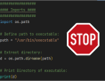
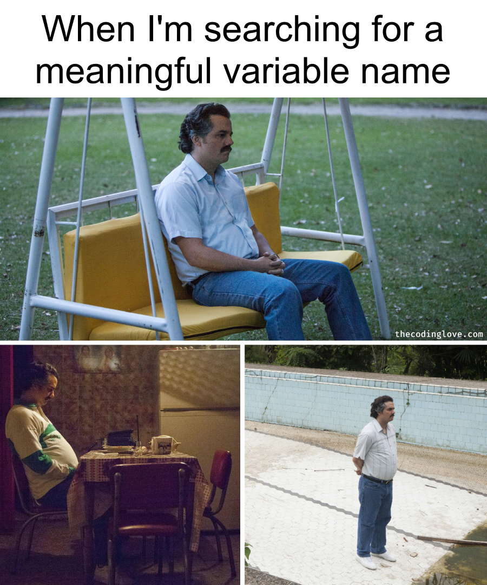

# 5 Reasons why Code Comments are a Code Smell 
{ align=right }

## 1. Comments that just describe what is happening

Let's have a look at the following code example:
```python
#################
#### Imports ####
#################
import os.path

# Define path to executable:
path = "/usr/bin/executable"

# Extract directory: 
d = os.path.dirname(path) 

# Print Directory of executable:
print(d)
```

These comments just obvioulsy just describe what happens in the code below them. This is however not necessary, because the code is easy to read if we just **name the variables better**:

```python
import os.path

path_to_executable = "/usr/bin/executable"
directory_of_executable = os.path.dirname(path_to_executable)
print(directory_of_executable)
```
## 2. Comments are a sign of too complex logic
Often, we see code comments when the code deals with complex or nested logic:

```python
# We do have to check, that the credit card of the user is not expired and that the user is solvent.
if user.state.value == "solvent" and user.credit_card.get_expiration_dt < datetime.datetime.now().date:
    # If we process Visa cards, online payment service has to be enabled:
    if not (user.credit_card.type == "Visa" and "online_payment" in user.credit_card.payment_services):
        raise OnlinePaymentServiceNotEnabledException("Visa Payment not possible.") 
    process_payment(user.credit_card, payment_details)
else:
    raise PaymentException("...")
```

This is not optimal to read and also there is the danger, that the comments will be outdated (see below) after some time. It is in this case better to define small functions with a proper name that describe what happens within the code:

```python
if is_solvent(user) and credit_card_is_active(credit_card:=user.credit_card):
    if not (credit_card.type == "Visa" and online_payment_service_enabled(credit_card)):
        raise OnlinePaymentServiceNotEnabledException("Visa Payment not possible.")
    process_payment(credit_card, payment_details)
else:
    raise PaymentException("...")


def is_solvent(user: User)->bool:
    return user.state.value == "solvent"

def credit_card_is_active(credit_card: CreditCard) -> bool:
    return credit_card.get_expiration_dt < datetime.datetime.now().date

def online_payment_service_enabled(credit_card: CreditCard)->bool:
    return "online_payment" in user.credit_card.payment_services
```


## 3. Comments that describe the implementation
```python

def calculate_distance(x: Vector, y: Vector) -> float:
    """The distance is calculated by:
            1. Calculate the difference between each components of the 2 vectors
            2. Square the differences
            3. Sum up 
            4. Take the squareroot
    """

    square_sum = 0
    for i in range(3):
        difference = x[i] - y[i]
        square = difference**2
        square_sum += square
    
    return sqrt(square_sum)
```

Why do we need this? The code described perfectly what is happening and there is not need to describe the implementation, also because the implementation can be changed in different ways (e.g. using a high-level libary like `numpy`).

## 4. Comments can be outdated
When code is changed or refactored, the **test suite** should ensure that the business logic and functionality of the program is still valid. However, **comments** are like dead code and are likely to be untouched by the programmer at hand. Thus, if the implementation changes, the comments are more likely to not describe the logic anymore. Even worse, these outdated ...

## 5. ... Comments can be missleading
Comments can be missleading, because they are not well written (*"hey, this is just a comment. No need to really be carefull writing these ..."*) or are outdated (like stated above). 

Consider the following example:
```python
# User is an adult:
if user_age >= 18:
    # User is active
    if user_is_active:
        process_payment()
    else:
        raise UserNotActiveException()
else:
    raise UserNotOldEnoughtException()
```

This is a pretty nested logic for such an easy business logic. Thus, we should invert the conditions to simplify the processing logic. So let us refactor this a bit
```python
# User is an adult:
if user_age < 18:
    raise UserNotOldEnoughtException()
# User is active
if not user_is_active:
    raise UserNotActiveException()
process_payment()
```

This code is obviously better, so the refactoring was a good idea. However, if you look closely, we forgot to adjust the code comments and now they are missleading.

## 6. Outcommmented code

Since we all have a good version control system at hand today (**#git**), there is really no way of storing old or unfinished code in the production branch. Keep these `dead code` parts away from production, **PERIOD**.

{ align=right width=300 }
## 7. Comments hide bad naming
Often, comments are used to describe a variable, because there was no effort to try to name the variable **properly**. Look at the following example:

```python
import datetime


def check_token_validity(token_dt):
    # We check that the token timestamp is only 1 hour old
    return datetime.datetime.now().timestamp() - token_dt < 3600
```

There are several things that we can improve on this code snippet:

1. The name `token_dt` implies that we have a `datetime` object at hand. However, if we look closely, we see that it is a **UTC Timestamp**!
2. Doing calculation in comparisons is generally a bad idea, because it makes the expression to complex to directly understand it
3. What is the 3600 doing there? What is the unit and why was it chosen? We should make it clearer what this number means.

Now, let us look at the refactored code:
```python
import datetime

MAXIMUM_TOKEN_LIFETIME_IN_SECONDS = 60 * 60

def check_token_validity(token_timestamp: float) -> bool:
    current_timestamp = datetime.datetime.now().timestamp()
    token_lifetime = current_timestamp - token_timestamp
    return token_lifetime < MAXIMUM_TOKEN_LIFETIME_IN_SECONDS
```

We have:
1. 


## Good Code Comments
After we have seen, that most common patterns of code comments are actually not a great idea, let us look at the exceptions:

#### 1. Code documentation

Code documentation for public APIs like docstrings can be a great idea, especially for libraries that are consumed by 3rd parties. These docstrings can then be picked up by documentation tools like **Sphinx** or **MKDocs** for an automated generation of nice API documentation.

Note, that is in general not necessary to put a code comment on private functions that are not part of the public API, because they should in general not be used by external user and typically have a higher rate of change than the public APIs. Therefore, they are prone to outdated and missleading docstrings/comments as described above. Typically, for these functions you should invest in a good function name that describes properly what it does without the need of additional commentary. If this is not possible, this is often a sign of a function that does 2 or more things and should therefore be split up and refactored to reduce its complexity. 

#### 2. Links and additional information about business logic

If a programm is written as a feature of a e.g. story, it may be a good idea to reference the story at the high-level code interface. Thus, when another programmer wants to know, why a functionality has been developed in the first place, he can go back to the story or additional user documentation.

#### 3. Additional details that explain the reasoning for the implementation if the latter is not obvious

There are code implementations or bugfixes that may not be obvious for a reader without the corresponding context. For these, there should be a reference to the corresponding issue or a comment describing the background information necessary to understand the maybe complex implementation. Think about something like this:

```python
import time

run_id = start_run()

# We have to wait a few seconds for the server to respond after the submission of a run. If we query for the run status
# too early, we will get an error, because the internal database of the service has to catch up:
time.sleep(WAIT_TIME_IN_SECONDS)

while True:
    run_finished = poke_for_run(run_id)
    if run_finished:
        break
```

A programmer without detailed knowledge of the external system will need additional information about the intend of a chosen solution to understand the reasoning.

#### 4. TODO Comments

Sometimes, when working on code we find a part of the code that is not well written or might have a bad side effect in the future, but we do not have the time to directly work on the problem. Or we see that we can improve an implementation and make it way more efficient. Leaving a `# TODO` comment can be a great way of finding those pieces in your code to later work on them.

#### 5. Warnings

Sometimes, there is a strange side effect or just something that a user has to know before he is calling the function at hand. Here, a warning comment may be appropriate.

