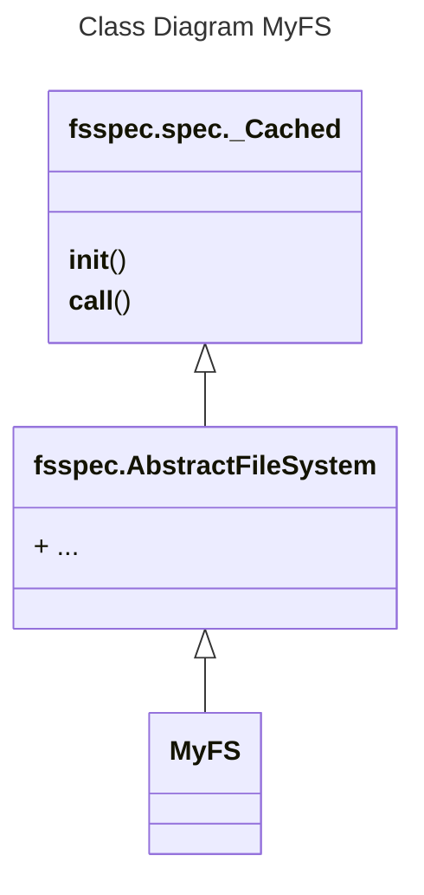

# Caution with Multiprocessing and ffspec Filesystems in Python
Multiprocessing can be a great way of scaling Python applications beyond one CPU core, especially due slow speed compared to other lower-level languages like C or Java. However, one has to be very careful when passing Python class instance, especially if your are using a [fsspec](https://filesystem-spec.readthedocs.io/en/latest/) filesystem implementation. 

**Note**: At time of writing of this article the newest `fsspec` release was [2023.3.0](https://github.com/fsspec/filesystem_spec/tree/2023.3.0).

## The Problem 

**Filesystem Spec** ([fsspec](https://filesystem-spec.readthedocs.io/en/latest/)) is a Python package that provides a unified interface for filesystems. However, one has to be very carefull, when running tasks on an fsspec Filesystem in parallel. Let us consider the following code:
```python
import multiprocessing
from fsspec import AbstractFileSystem

multiprocessing.set_start_method("fork")


class MyClass:
    def __init__(self):
        self.store: dict[str, str] = {}


class MyFS(AbstractFileSystem):
    def __init__(self):
        self.store: dict[str, str] = {}


def return_store(my_class: MyClass) -> str:
    return f"Class Name: {my_class.__class__.__name__: <10} Store: {my_class.store}"


# Create class instance in parent process and add stuff to the internal store:
my_class = MyClass()
my_class.store["added"] = "content"

my_fs = MyFS()
my_fs.store["added"] = "content"


# Run the function in a child process:
with multiprocessing.Pool(processes=2) as pool:
    messages = pool.map(
        return_store,
        [my_class, my_fs],
    )


# Print out store content from child processes:
for message in messages:
    print(message)

```

What we have here are two very simple classes `MyClass` and `MyFS` that just create an empty *dictionary* `store` attribute when instantiated. The key difference between these two classes is that `MyFS` is inherited from `fsspec.AbstractFileSystem`. We then create an instance of each of the two classes and add an entry to the `store` *dictionary*. Finally, we run a simple function in 2 child processes that just prints out the content of the `store` attribute. The resulting output of this script will be:

    Class Name: MyClass    Store: {'added': 'content'}
    Class Name: MyFS       Store: {}

As can be seen, the `store` attribute of the `MyFS` class does **not contain the added entry**, whereas the same class without inheritance from the `AbstractFileSystem` does contain the non-empty dictionary. The reason behind these two different behaviours lies in the **caching** implementation of `fsspec`. The inheritance diagram looks like:


[This line](https://github.com/fsspec/filesystem_spec/blob/2023.3.0/fsspec/spec.py#L70) in the `_Cached` base is responsible for removing all existing attributes on the class instance when it will be forked for the child process:
```python hl_lines="5 6 7"
class _Cached(type):
    ...
    def __call__(cls, *args, **kwargs):
        ...
        if os.getpid() != cls._pid:
            # In a child process, this line is called and will clear all existing attributes:
            cls._cache.clear()        
        ...
        
```

## Possible solutions

If you really want to parallelize applications with an `fsspec` Filesystem, there are at least 2 solutions.

### Use threading

If you run the code above with a `multiprocessing.pool.ThreadPool` instead of a `multiprocessing.Pool`, it just runs fine and does not show the observed caching behaviour.                                                              
### Instantiate the filesystem inside the processes itself

Instead of passing the instatiated filesystem directly into the subprocess, it is better to use an **Adapter** that stores the information about the filesystem and can create an instance of it. Let us consider the following example:
```python
import multiprocessing
from fsspec.implementations.github import GithubFileSystem

multiprocessing.set_start_method("fork")


class GithubFileSystemAdapter:
    def __init__(self, org: str, repo: str):
        self.org = org
        self.repo = repo

    def get_github_fs(self) -> GithubFileSystem:
        return GithubFileSystem(org=self.org, repo=self.repo)


def list_root_directory_of_repository(
    github_fs_adapter: GithubFileSystemAdapter,
) -> list[str]:
    # Create fsspec filesystem inside child process:
    github_fs = github_fs_adapter.get_github_fs()
    return github_fs.ls("/")


# Create GithubFileSystemAdapter for 'https://github.com/python/cpython':
github_fs_adapter = GithubFileSystemAdapter(org="python", repo="cpython")


# Run the function in a child process:
with multiprocessing.Pool(processes=1) as pool:
    messages = pool.map(
        list_root_directory_of_repository,
        [github_fs_adapter],
    )

# Print out store content from child process:
for message in messages:
    print(message)

```

As can be seen, we define a container class `GithubFileSystemAdapter` that simply stores the data and implements a method for creating the filesystem. This container class is then passed to the child process, within which the `fsspec` filessystem object is created. It can then be safely used without the problems seen in the previous example.
